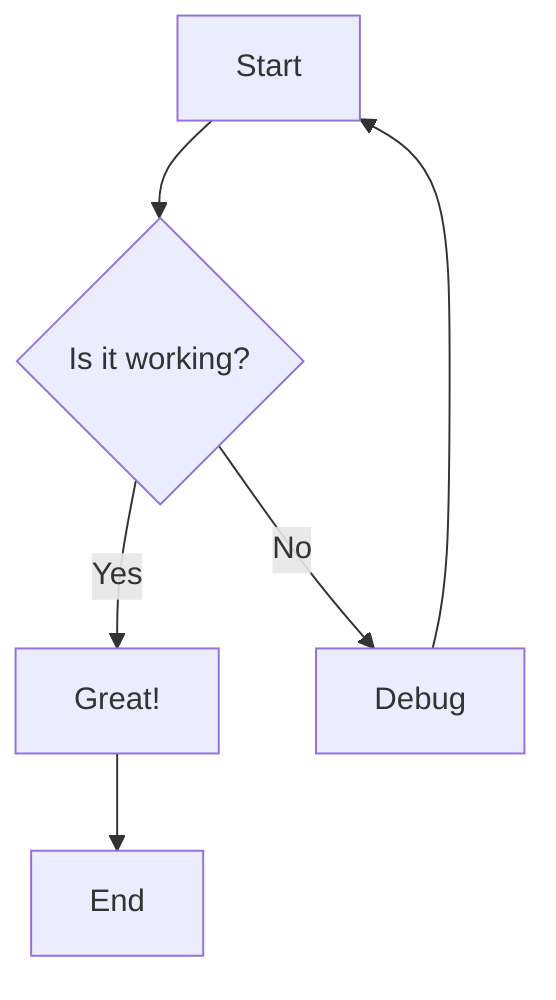
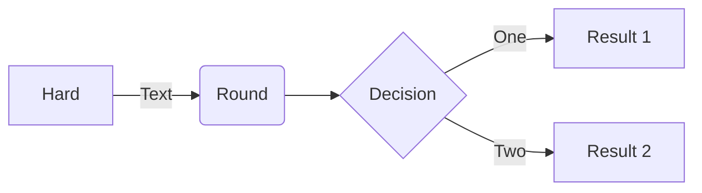
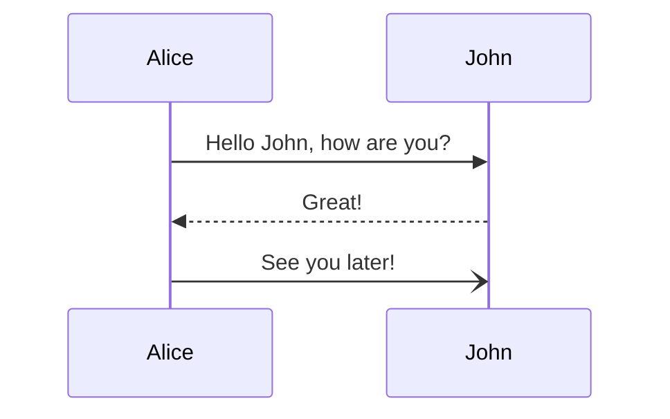

# Render Mermaid OnTheFly

A Chrome extension that renders Mermaid diagrams from selected text with an interactive, movable overlay. Built with TypeScript and modern web technologies.

## Features

- **Context Menu Integration**: Right-click on selected text and choose "Render Mermaid" to visualize diagrams
- **Interactive Overlay**: Diagrams appear in a beautiful, draggable overlay window
- **Zoom Controls**: Zoom in/out with buttons or mouse wheel
- **Pan Support**: Click and drag to pan around large diagrams
- **Export to PNG**: Export rendered diagrams as high-quality PNG images
- **Resizable Window**: Resize the overlay to fit your needs
- **Beautiful UI**: Modern gradient design with smooth animations
- **TypeScript**: Fully typed and compiled for reliability
- **Manifest v3**: Compliant with the latest Chrome extension standards

## Development

### Prerequisites

- Node.js 16+ and npm
- Chrome/Chromium browser

### Building from Source

1. Clone this repository:
   ```bash
   git clone <repository-url>
   cd Render-Mermaid-OnTheFly
   ```

2. Install dependencies:
   ```bash
   npm install
   ```

3. Build the extension:
   ```bash
   npm run build
   ```

   This will compile TypeScript files and bundle them into the `dist/` directory.

4. For development with auto-rebuild:
   ```bash
   npm run dev
   ```

### Project Structure

```
Render-Mermaid-OnTheFly/
├── src/                  # Source files (TypeScript)
│   ├── background.ts     # Background service worker
│   ├── content.ts        # Content script with rendering logic
│   ├── styles.css        # Overlay styling
│   ├── manifest.json     # Extension configuration
│   └── icons/            # Extension icons
├── dist/                 # Compiled output (generated)
│   ├── background.js     # Compiled background script
│   ├── content.js        # Compiled content script
│   ├── manifest.json     # Copied manifest
│   ├── styles.css        # Copied styles
│   └── icons/            # Copied icons
├── webpack.config.js     # Webpack configuration
├── tsconfig.json         # TypeScript configuration
├── package.json          # Node dependencies
└── README.md            # This file
```

## Installation

### Install from Source

1. Build the extension (see "Building from Source" above)
2. Open Chrome and navigate to `chrome://extensions/`
3. Enable "Developer mode" using the toggle in the top-right corner
4. Click "Load unpacked"
5. Select the `dist/` directory from this project

## Usage

1. **Select Mermaid Code**: Highlight any Mermaid diagram syntax on a webpage
2. **Right-Click**: Open the context menu
3. **Click "Render Mermaid"**: The diagram will render in an overlay

### Example Mermaid Code

Try selecting and rendering this code:



Or a flowchart:



Or a sequence diagram:



## Controls

### Overlay Controls

- **Zoom In (+)**: Increase diagram size
- **Zoom Out (−)**: Decrease diagram size
- **Reset (100%)**: Reset zoom to default
- **Export PNG**: Download diagram as PNG image
- **Close (✕)**: Close the overlay

### Mouse Controls

- **Drag Header**: Move the overlay window
- **Mouse Wheel**: Zoom in/out (while hovering over diagram)
- **Click + Drag on Diagram**: Pan around the diagram
- **Drag Bottom-Right Corner**: Resize the overlay

## Keyboard Shortcuts

- The extension uses the context menu, so no keyboard shortcuts are required
- You can close the overlay by clicking the close button

## Supported Mermaid Diagrams

This extension supports all Mermaid diagram types:

- Flowcharts
- Sequence Diagrams
- Class Diagrams
- State Diagrams
- Entity Relationship Diagrams
- User Journey
- Gantt Charts
- Pie Charts
- Requirement Diagrams
- Gitgraph
- And more!

## Technical Details

### Dependencies

- **Mermaid.js**: Bundled directly into the extension (v10.6.1+)
- **TypeScript**: For type safety and better code quality
- **Webpack**: For bundling and optimization

### Build Dependencies

Development tools (not included in final extension):
- `typescript`: TypeScript compiler
- `webpack`: Module bundler
- `ts-loader`: TypeScript loader for webpack
- `copy-webpack-plugin`: Copies static assets
- `@types/chrome`: Chrome extension type definitions

### Permissions

- `contextMenus`: To add the "Render Mermaid" option
- `activeTab`: To inject the overlay into the current page

### Browser Compatibility

- Chrome/Chromium 88+
- Edge 88+
- Other Chromium-based browsers with Manifest V3 support

## Troubleshooting

### Diagram doesn't render

- Check if the selected text is valid Mermaid syntax
- Open the browser console (F12) to see error messages
- The extension bundles Mermaid.js, so no internet connection is required

### Overlay doesn't appear

- Check if the extension is enabled in `chrome://extensions/`
- Refresh the page and try again
- Check the console for JavaScript errors
- Ensure you've built the extension with `npm run build`

### Build fails

- Ensure Node.js 16+ is installed
- Delete `node_modules/` and `package-lock.json`, then run `npm install` again
- Check for any TypeScript errors in your source files

### Export doesn't work

- Ensure the diagram rendered successfully first
- Check browser permissions for downloads
- Try a different browser if the issue persists

## Development Workflow

### Making Changes

1. Edit source files in the `src/` directory:
   - `src/background.ts` - Background service worker logic
   - `src/content.ts` - Content script with overlay and rendering
   - `src/styles.css` - Visual styling
   - `src/manifest.json` - Extension configuration

2. Rebuild the extension:
   ```bash
   npm run build
   ```

3. Reload the extension in Chrome:
   - Go to `chrome://extensions/`
   - Click the refresh icon on the extension card
   - Test your changes

### Regenerating Icons

If you want to customize the icons:

```bash
python3 generate_icons.py
```

This will create new 16x16, 48x48, and 128x128 PNG icons in the `src/icons/` directory.

### Code Quality

The project uses TypeScript for type safety and better developer experience. All source code is strictly typed and compiled with strict mode enabled.

## Privacy

This extension:
- Does NOT collect any data
- Does NOT send data to external servers
- Bundles Mermaid.js locally (no CDN required)
- Only processes selected text locally in your browser
- Does NOT track your browsing history

## License

MIT License - Feel free to use and modify as needed.

## Contributing

Contributions are welcome! Feel free to:
- Report bugs
- Suggest features
- Submit pull requests

## Credits

- Built with [Mermaid.js](https://mermaid.js.org/)
- Icons generated with Python and Pillow

## Support

If you encounter any issues or have questions, please open an issue on the repository.

---

**Enjoy visualizing Mermaid diagrams on the fly!**
