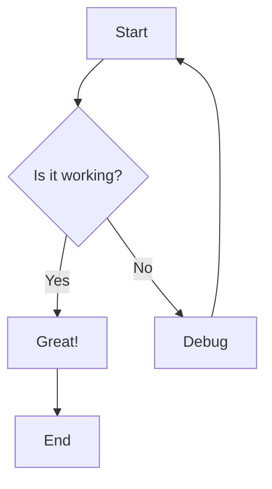
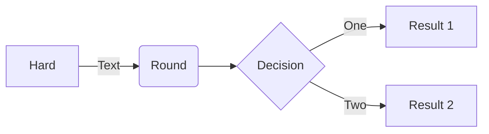
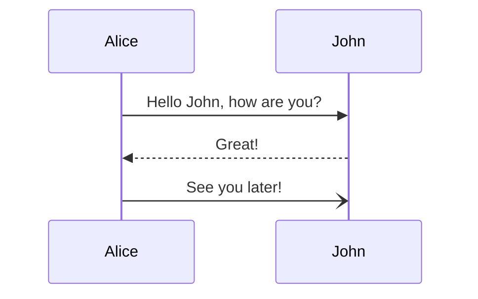

# Render Mermaid OnTheFly

A Chrome extension that renders Mermaid diagrams from selected text with an interactive, movable overlay.

## Features

- **Context Menu Integration**: Right-click on selected text and choose "Render Mermaid" to visualize diagrams
- **Interactive Overlay**: Diagrams appear in a beautiful, draggable overlay window
- **Zoom Controls**: Zoom in/out with buttons or mouse wheel
- **Pan Support**: Click and drag to pan around large diagrams
- **Export to PNG**: Export rendered diagrams as high-quality PNG images
- **Resizable Window**: Resize the overlay to fit your needs
- **Beautiful UI**: Modern gradient design with smooth animations

## Installation

### Install from Source

1. Clone or download this repository
2. Open Chrome and navigate to `chrome://extensions/`
3. Enable "Developer mode" using the toggle in the top-right corner
4. Click "Load unpacked"
5. Select the extension directory

### File Structure

```
Render-Mermaid-OnTheFly/
├── manifest.json          # Extension configuration
├── background.js          # Context menu handler
├── content.js            # Overlay and rendering logic
├── styles.css            # Overlay styling
├── icons/                # Extension icons
│   ├── icon16.png
│   ├── icon48.png
│   └── icon128.png
├── generate_icons.py     # Icon generator script
└── README.md            # This file
```

## Usage

1. **Select Mermaid Code**: Highlight any Mermaid diagram syntax on a webpage
2. **Right-Click**: Open the context menu
3. **Click "Render Mermaid"**: The diagram will render in an overlay

### Example Mermaid Code

Try selecting and rendering this code:



Or a flowchart:



Or a sequence diagram:



## Controls

### Overlay Controls

- **Zoom In (+)**: Increase diagram size
- **Zoom Out (−)**: Decrease diagram size
- **Reset (100%)**: Reset zoom to default
- **Export PNG**: Download diagram as PNG image
- **Close (✕)**: Close the overlay

### Mouse Controls

- **Drag Header**: Move the overlay window
- **Mouse Wheel**: Zoom in/out (while hovering over diagram)
- **Click + Drag on Diagram**: Pan around the diagram
- **Drag Bottom-Right Corner**: Resize the overlay

## Keyboard Shortcuts

- The extension uses the context menu, so no keyboard shortcuts are required
- You can close the overlay by clicking the close button

## Supported Mermaid Diagrams

This extension supports all Mermaid diagram types:

- Flowcharts
- Sequence Diagrams
- Class Diagrams
- State Diagrams
- Entity Relationship Diagrams
- User Journey
- Gantt Charts
- Pie Charts
- Requirement Diagrams
- Gitgraph
- And more!

## Technical Details

### Dependencies

- **Mermaid.js**: Loaded via CDN (https://cdn.jsdelivr.net/npm/mermaid@10/)
- No other external dependencies required

### Permissions

- `contextMenus`: To add the "Render Mermaid" option
- `activeTab`: To inject the overlay into the current page
- `scripting`: To dynamically inject content scripts when needed
- `notifications`: To show error notifications to users

### Browser Compatibility

- Chrome/Chromium 88+
- Edge 88+
- Other Chromium-based browsers

## Troubleshooting

For detailed debugging instructions, see **[DEBUGGING.md](DEBUGGING.md)**.

### Quick Fixes

**Diagram doesn't render:**
- Check if the selected text is valid Mermaid syntax
- Open the browser console (F12) to see detailed error messages
- Ensure you have an internet connection (required to load Mermaid.js)
- Look for `[Mermaid Content]` messages in console

**Overlay doesn't appear:**
- Check if the extension is enabled in `chrome://extensions/`
- Reload the extension (click the refresh icon)
- Refresh the page and try again
- Check the console for JavaScript errors

**Export doesn't work:**
- Ensure the diagram rendered successfully first
- Check browser permissions for downloads
- Try a different browser if the issue persists

**"Could not establish connection" error:**
- This is automatically fixed in v1.1.0+
- If you still see this, try reloading the extension
- See DEBUGGING.md for more details

## Development

### Regenerating Icons

If you want to customize the icons:

```bash
python3 generate_icons.py
```

This will create new 16x16, 48x48, and 128x128 PNG icons in the `icons/` directory.

### Modifying the Extension

1. Make changes to the source files
2. Go to `chrome://extensions/`
3. Click the refresh icon on the extension card
4. Test your changes

## Privacy

This extension:
- Does NOT collect any data
- Does NOT send data to external servers (except loading Mermaid.js from CDN)
- Only processes selected text locally in your browser
- Does NOT track your browsing history

## License

MIT License - Feel free to use and modify as needed.

## Contributing

Contributions are welcome! Feel free to:
- Report bugs
- Suggest features
- Submit pull requests

## Credits

- Built with [Mermaid.js](https://mermaid.js.org/)
- Icons generated with Python and Pillow

## Support

If you encounter any issues or have questions, please open an issue on the repository.

---

**Enjoy visualizing Mermaid diagrams on the fly!**
